```{r}
#| echo: false
#| include: false

knitr::opts_chunk$set(comment = "", collapse = TRUE)

## working directory
setwd("c:\\Users\\chris\\Documents\\Github-repository\\data-viz-presentation\\02-ggplot")

## libraries
pacman::p_load(knitr, tidyverse, metathis)

## theme
theme_set(theme_minimal()) +
  theme(axis.title = element_text(size = 14))

```

## Outline

-   The grammar of graphics

-   Datasets and mapping

-   Geometries

-   Statistical transformation and plotting distribution

-   Position adjustment and scales

-   Coordinates and themes

-   Facets and custom plots

# The grammar of graphics

## Why ggplot2?

::::: columns
::: {.column width="50%"}
-   Most requested programming languages for data scientists are R and Python.

-   ggplot2 as a visualization package for R, is becoming an industry standard for visualization.
:::

::: {.column width="50%"}
```{r}
#| echo: FALSE
#| out-width: 40%
#| fig-align: center

knitr::include_graphics("image/ggplot2_logo.png")
```
:::
:::::

## Why grammar?

:::::: columns
::: {.column width="50%"}
-   You can create new sentences if you know about the grammar.

-   In ggplot2 context, you can create new graphics or tailored plot that suits your needs or preferences.
:::

:::: {.column width="50%"}
```{r}
#| echo: FALSE
#| out-width: 50%
#| fig-align: center

knitr::include_graphics("image/gg_book_cover.jfif")
```

::: aside
Source: [The grammar of graphics](https://link.springer.com/book/10.1007/0-387-28695-0)\]
:::
::::
::::::

## The idea of grammar of graphics

::::: columns
::: {.column width="50%"}
:::

::: {.column width="50%"}
<br>

```{r}
#| echo: FALSE
#| out-width: 95%
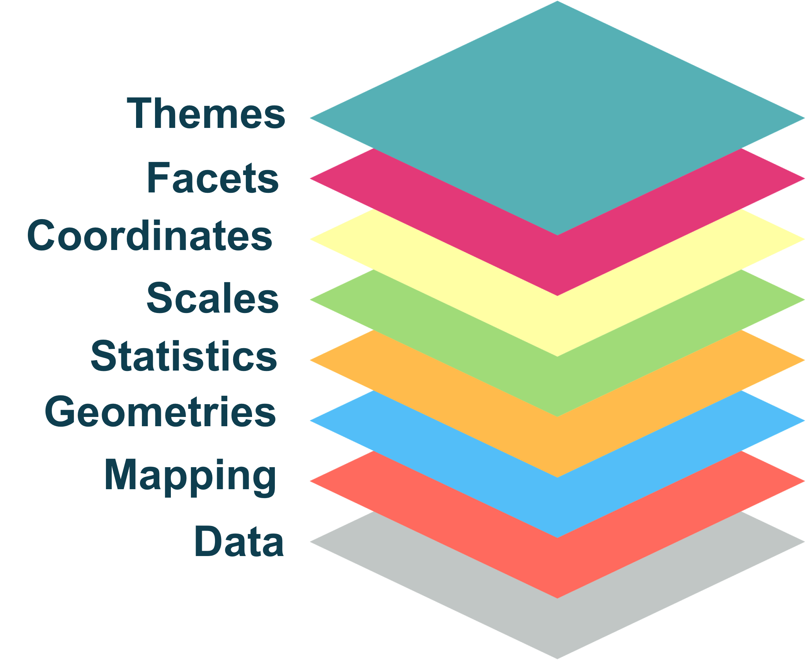
```
:::
:::::

## The idea of grammar of graphics

::::: columns
::: {.column width="50%"}
```{r}
#| include: FALSE

data1 <- sample_n(diamonds, 15000)
```

```{r}
#| echo: FALSE
#| fig-height: 8

ggplot(data = data1) +
  theme_gray()
```
:::

::: {.column width="50%"}
```{r}
#| echo: FALSE
#| out-width: 80%
#| fig-align: center

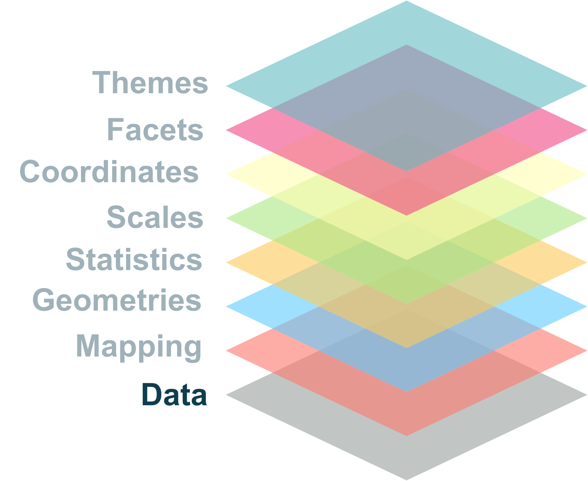
```

``` {.r code-line-numbers="1"}
ggplot(data = data1)
```
:::
:::::

## The idea of grammar of graphics

::::: columns
::: {.column width="50%"}
```{r}
#| echo: FALSE
#| fig-height: 9

ggplot(data = data1, 
       mapping = aes(x = price, y = carat, color = clarity)) +
  theme(axis.title = element_text(size = 20),
        axis.text = element_text(size = 16))
```
:::

::: {.column width="50%"}
```{r}
#| echo: false
#| out-width: 80%
#| fig-align: center

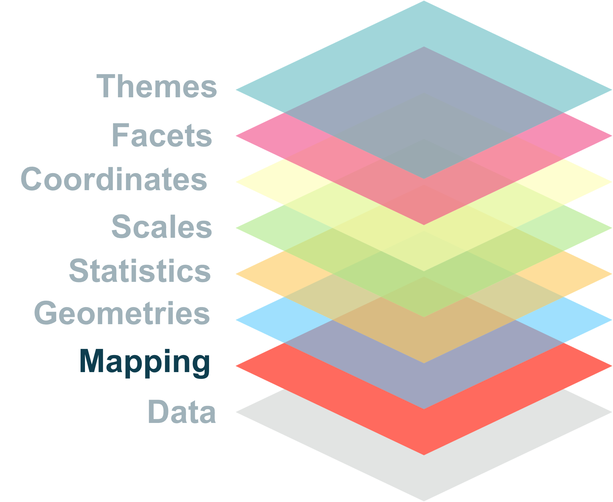
```

``` {.r code-line-numbers="2"}
ggplot(data = data1, 
       mapping = aes(x = price, y = carat))
```
:::
:::::

## The idea of grammar of graphics

::::: columns
::: {.column width="50%"}
```{r}
#| echo: FALSE
#| fig-height: 9

ggplot(data = data1, 
       mapping = aes(x = price, y = carat, color = clarity)) +
  geom_point() +
  theme(axis.title = element_text(size = 20),
        axis.text = element_text(size = 16))
```
:::

::: {.column width="50%"}
```{r}
#| echo: false
#| out-width: 80%
#| fig-align: center

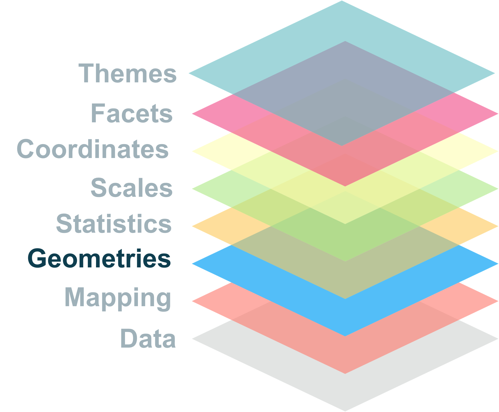
```

``` {.r code-line-numbers="3"}
ggplot(data = data1, 
       mapping = aes(x = price, y = carat, color = clarity)) +
       geom_point()
```
:::
:::::

## The idea of grammar of graphics

::::: columns
::: {.column width="50%"}
```{r}
#| echo: FALSE
#| fig-height: 9

ggplot(data = data1, 
       mapping = aes(x = price, y = carat, color = clarity)) +
  geom_point() +
  stat_smooth() +
  theme(axis.title = element_text(size = 20),
        axis.text = element_text(size = 16))
```
:::

::: {.column width="50%"}
```{r}
#| echo: false
#| out-width: 80%
#| fig-align: center

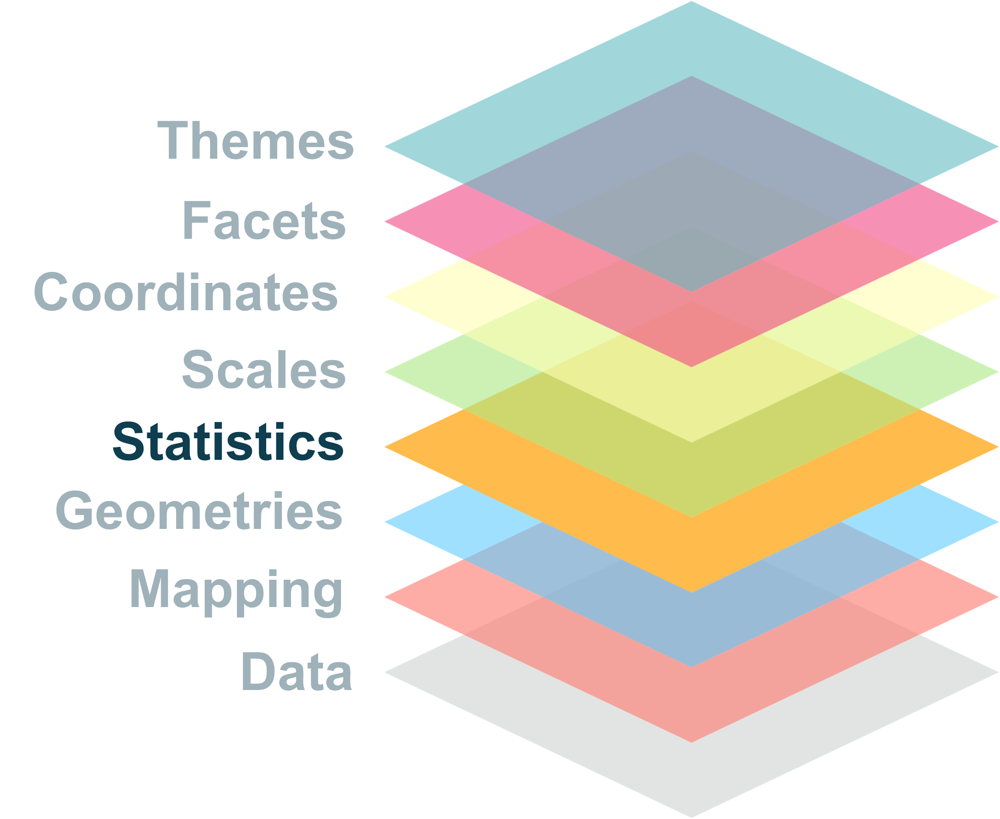
```

``` {.r code-line-numbers="4"}
ggplot(data = data1, 
       mapping = aes(x = price, y = carat, color = clarity)) +
       geom_point() +
       stat_smooth()
```
:::
:::::

## The idea of grammar of graphics

::::: columns
::: {.column width="50%"}
```{r}
#| echo: FALSE
#| fig-height: 9

ggplot(data = data1, 
       mapping = aes(x = price, y = carat, color = clarity)) +
  geom_point() +
  stat_smooth() +
  scale_x_log10() +
  theme(axis.title = element_text(size = 20),
       axis.text = element_text(size = 16))
```
:::

::: {.column width="50%"}
```{r}
#| echo: false
#| out-width: 80%
#| fig-align: center

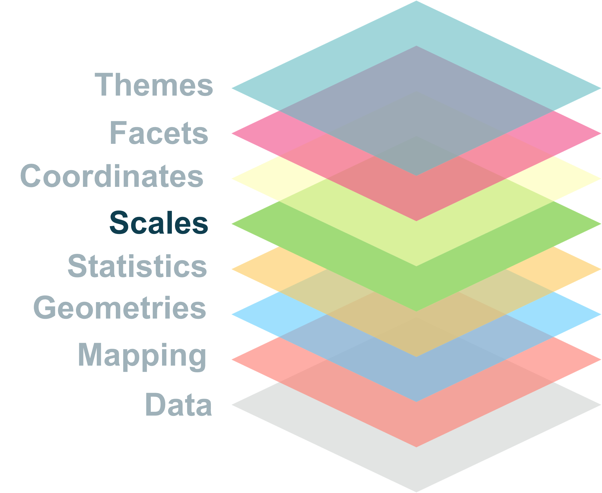
```

``` {.r code-line-numbers="5"}
ggplot(data = data1, 
       mapping = aes(x = price, y = carat, color = clarity)) +
       geom_point() +
       stat_smooth() +
       scale_x_log10()
```
:::
:::::

## The idea idea of grammar of graphics

::::: columns
::: {.column width="50%"}
```{r fig.height=7, echo=FALSE}
#| echo: false
#| fig-height: 9

ggplot(data = data1, 
       mapping = aes(x = price, y = carat, color = clarity)) +
  geom_point() +
  stat_smooth() +
  scale_x_log10() +
  coord_flip()
```
:::

::: {.column width="50%"}
```{r echo=FALSE, out.width="50%", fig.align='center'}
#| echo: false
#| out-width: 80%
#| fig-align: center

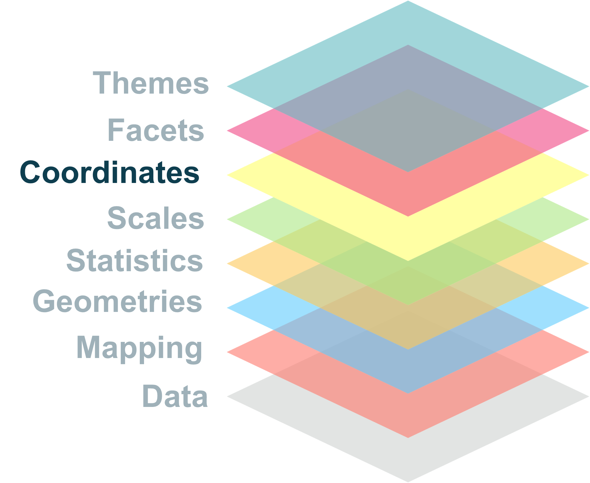
```

``` {.r code-line-numbers="6"}
ggplot(data = data1, 
       mapping = aes(x = price, y = carat, color = clarity)) +
       geom_point() +
       stat_smooth() +
       scale_x_log10() +
       coord_flip()
```
:::
:::::

## The idea of grammar of graphics

::::: columns
::: {.column width="50%"}
```{r fig.height=7, echo=FALSE}
#| echo: false
#| fig-height: 9

ggplot(data = data1, 
       mapping = aes(x = price, y = carat, color = clarity)) +
  geom_point() +
  stat_smooth() +
  scale_x_log10() +
  coord_flip() +
  facet_wrap(~ cut) +
  theme(axis.title = element_text(size = 20),
        axis.text = element_text(size = 16))
```
:::

::: {.column width="50%"}
```{r echo=FALSE, out.width="50%", fig.align='center'}
#| echo: false
#| out-width: 80%
#| fig-align: center

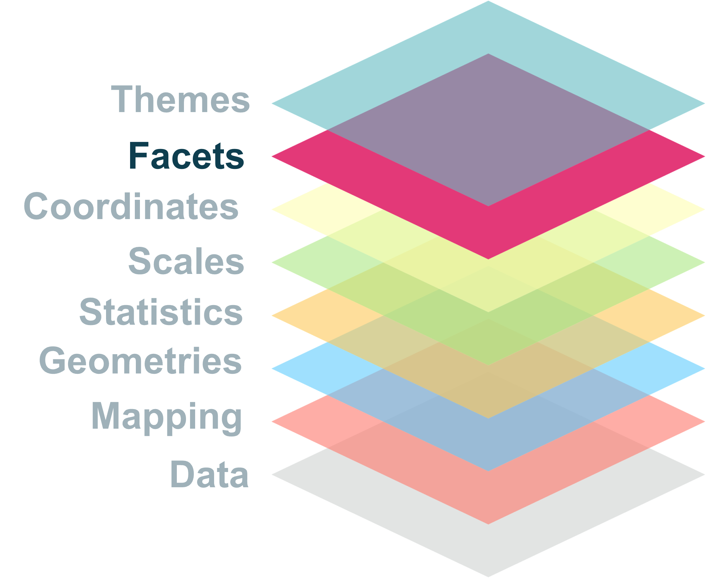
```

``` {.r code-line-numbers="7"}
ggplot(data = data1, 
       mapping = aes(x = price, y = carat, color = clarity)) +
       geom_point() +
       stat_smooth() +
       scale_x_log10() +
       coord_flip() +
       facet_wrap(~ cut)
```
:::
:::::

## The idea of grammar of graphics

::::: columns
::: {.column width="50%"}
```{r fig.height=7, echo=FALSE}
#| echo: false
#| fig-height: 9

ggplot(data = data1, 
       mapping = aes(x = price, y = carat, color = clarity)) +
  geom_point() +
  stat_smooth() +
  scale_x_log10() +
  coord_flip() +
  facet_wrap(~ cut) +
  theme_light() + 
  theme(axis.title = element_text(size = 20),
        axis.text = element_text(size = 16))
```
:::

::: {.column width="50%"}
```{r echo=FALSE, out.width="50%", fig.align='center'}
#| echo: false
#| out-width: 80%
#| fig-align: center

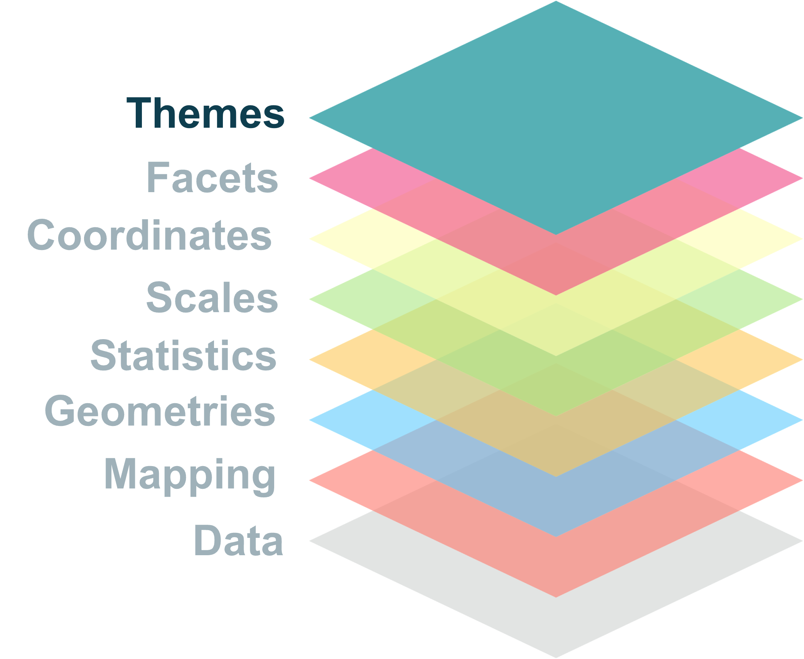
```

``` {.r code-line-numbers="8"}
ggplot(data = data1, 
       mapping = aes(x = price, y = carat, color = clarity)) +
       geom_point() +
       stat_smooth() +
       scale_x_log10() +
       coord_flip() +
       facet_wrap(~ cut) +
       theme_light()
```
:::
:::::

# Data and mapping

## Data

::::: columns
::: {.column width="60%"}
-   syntax

``` {.r code-line-numbers="1"}
ggplot(data = <dataset>)
```

-   For ggplot graphs, data are usually wrangled.

-   Tidy data

    -   Each variable is a column

    -   Each observation is a row

    -   Each value is a cell
:::

::: {.column width="40%"}
```{r}
#| echo: FALSE
#| out-width: 95%
#| fig-align: center


```
:::
:::::

## Mapping

::::: columns
::: {.column width="60%"}
-   syntax

``` {.r code-line-numbers="2"}
ggplot(data = <dataset>,
       mapping = aes(x = <var1>, y = <var2>, ...))
```

-   Variables are mapped to graphic's visual properties with **aesthetics mapping**

-   Usually we map:

    -   one variable on x axis

    -   one variable on y axis

    -   mapped to color, shape, fill, group, etc.
:::

::: {.column width="40%"}
```{r out.width="70%", fig.align='center', echo=FALSE}
#| echo: FALSE
#| out-width: 95%
#| fig-align: center


```
:::
:::::

## Data and mapping

::::: columns
::: {.column width="60%"}
-   Can specify data and mappings in the plot category

``` r
ggplot(data = mydata, mapping = aes(x = varX, y = varY))
```

-   Or specify for each layer

``` {.r code-line-numbers="2"}
ggplot() +
  geom_point(data = mydata, mapping = aes(x = varX, y =varY))
```
:::

::: {.column width="40%"}
```{r}
#| echo: FALSE
#| out-width: 95%
#| fig-align: center

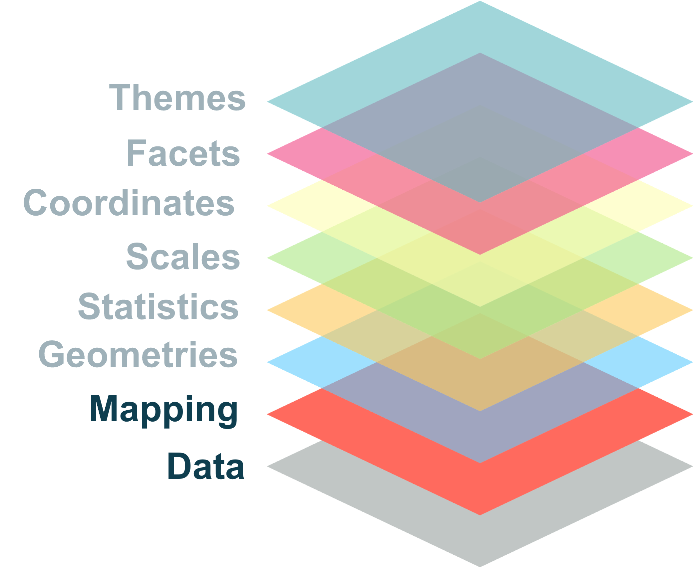
```
:::
:::::

## Data and mapping

::::: columns
::: {.column width="50%"}
``` {.r code-line-numbers="2"}
ggplot(data = mpg, 
       mapping = aes(x = displ, y = hwy, color = class)) +
       geom_point() +
       geom_smooth(se = FALSE)
```

```{r}
#| echo: FALSE
#| fig-height: 7
ggplot(data = mpg, 
       mapping = aes(x = displ, y = hwy, color = class)) + 
  geom_point(size = 4) +
  geom_smooth(se = FALSE, size = 1.5) +
  theme(axis.title = element_text(size = 24),
        axis.text = element_text(size = 16))

```
:::

::: {.column width="50%"}
``` {.r code-line-numbers="3"}
ggplot(data = mpg, 
       mapping = aes(x = displ, y = hwy)) +
       geom_point(aes(color = class)) +
       geom_smooth(se = FALSE)
```

```{r}
#| echo: FALSE
#| fig-height: 7

ggplot(data = mpg, 
       mapping = aes(x = displ, y = hwy)) +
  geom_point(aes(color = class), size = 4) +
  geom_smooth(se = FALSE, size = 1.5) +
  theme(axis.title = element_text(size = 24),
        axis.text = element_text(size = 16))

```
:::
:::::

## Aesthetic mapping

::::: columns
::: {.column width="50%"}
**mapping**

``` {.r code-line-numbers="2"}
ggplot(data = mpg, 
       mapping = aes(x = displ, y = hwy, color = class)) +
       geom_point()
```

```{r}
#| echo: FALSE
#| fig-height: 7

ggplot(data = mpg, 
       mapping = aes(x = displ, y = hwy, color = class)) +
       geom_point(size = 4) +
       theme(axis.title = element_text(size = 24),
        axis.text = element_text(size = 16))
```
:::

::: {.column width="50%"}
**setting**

``` {.r code-line-numbers="3"}
ggplot(data = mpg, 
       mapping = aes(x = displ, y = hwy, color = class)) +
       geom_point(color  = "red")
```

```{r}
#| echo: FALSE
#| fig-height: 7
ggplot(data = mpg, 
       mapping = aes(x = displ, y = hwy, color = class)) +
       geom_point(color = "red", size = 4) +
       theme(axis.title = element_text(size = 24),
       axis.text = element_text(size = 16))
```
:::
:::::

# Geometries

## Geometries

::::: columns
::: {.column width="50%"}
-   syntax

``` {.r code-line-numbers="3"}
ggplot(data = <dataset>,
       mapping = aes(x = <varX>, y = <varY>, ...)) +
  geom_<function>(...)
```

-   Geometry stands for geom function

-   Tell R how to render each data point on a given figure.
:::

::: {.column width="50%"}
```{r}
#| echo: FALSE
#| out-width: 95%
#| fig-align: center

```
:::
:::::

## Geometries

```{r}
#| echo: FALSE
#| out-width: 95%
knitr::include_graphics("image/geom_collection.png")
```

::: aside
Source: [National Bioinformatics Insfrastructure Sweden (NBIS), 2019](https://github.com/NBISweden/RaukR-2019/blob/master/docs/ggplot/presentation/ggplot_presentation_assets/geoms.png)\]
:::

## Geometries

::::: columns
::: {.column width="40%"}
-   Each geom can display certain aesthetics.

-   Some of them are required.
:::

::: {.column width="60%"}
```{r echo=FALSE, out.width="90%"}
#| echo: FALSE
#| out-width: 95%
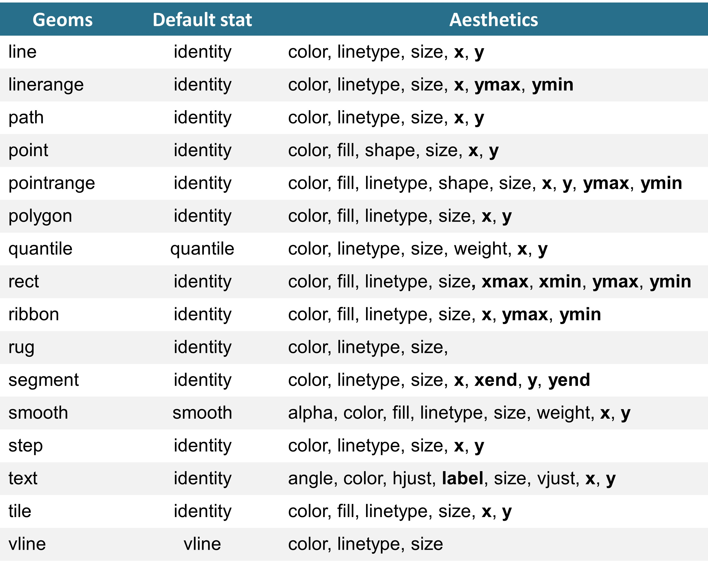
```
:::
:::::

## Geometries

:::::: columns
**Line plots**

Aesthetics of `geom_path`, `geom_line`, `geom_step`:

::: {.column width="40%"}
-   x
-   y
-   alpha
-   colour/ color
-   linetype
-   size
-   group
:::

:::: {.column width="60%"}
::: {.callout-tip style="font-size: 1.5em;" appearance="minimal"}
We will use the `babynames` data from the `babynames` package for demonstration.
:::

``` r
library(babynames)
glimpse(babynames)
```

```{r}
#| echo: FALSE

library(babynames)
glimpse(babynames)
```
::::
::::::

## Exercise 1

::::: columns
::: {.column width="40%"}

-   Recreate the plot shown on the right.
:::

::: {.column width="60%"}
```{r}
#| echo: FALSE
#| fig-height: 7
#| fig-align: center

friends <- babynames %>% 
  filter(year >= 1950,
         name %in% c("Christopher", "Dave", "Karl"),
         sex == "M")

ggplot(data = friends,
       mapping = aes(x = year, y = n, color = name)) +
  geom_line(linetype = "dashed") +
  geom_point(size = 4, alpha = 0.5) +
  scale_y_log10() +
  theme_minimal() +
  theme(axis.title = element_text(size = 24),
        axis.text = element_text(size = 16),
        legend.text = element_text(size = 16),
        legend.title = element_text(size = 18)
        )

```
:::
:::::

## Geometries

::::: columns
::: {.column width="60%"}
**Scatterplots**

We can derived plots like:

-   Connected scatter plot (if `geom_line` is added)
-   Bubble plot (mapping size to a variable)

To avoid overlappping

-   alpha aesthetic
-   "jitter" or `geom_jitter` for position
:::

::: {.column width="40%"}
``` r
geom_point(
  mapping = NULL,
  data = NULL,
  stat = "identity",
  position = "identity",
  ...,
  na.rm = FALSE,
  show.legend = NA,
  inherit.aes = TRUE
)
```
:::
:::::

## Geometries

::::: columns
::: {.column width="60%"}
**Scatterplots**

#### Colors

-   continuous data

    -   `scale_color_gradient`
    -   `scale_fill_gradient`

-   discrete data

    -   `scale_color_manual`
    -   `scale_fill_manual`
:::

::: {.column width="40%"}
``` r
geom_point(
  mapping = NULL,
  data = NULL,
  stat = "identity",
  position = "identity",
  ...,
  na.rm = FALSE,
  show.legend = NA,
  inherit.aes = TRUE
)
```
:::
:::::

## Exercise 2

::::: columns
::: {.column width="50%"}

Use the `mpg` data to recreate the plot shown on the right.
:::

::: {.column width="50%"}
```{r}
#| echo: FALSE
#| fig-height: 9
#| fig-align: center
#| warning: FALSE

mean_hwy_data <- mpg %>% 
  group_by(class) %>% 
  summarise(mean_hwy = mean(hwy, na.rm = TRUE))

ggplot(data = mpg,
       mapping = aes(x = class, y = hwy, color = class)) +
  geom_point(position = "jitter", size = 3, alpha = 0.5) +
  geom_point(data = mean_hwy_data, aes(y = mean_hwy), size = 7) +
  labs(title = "Fuel consumption per class vehicle",
       x = "Class of vehicle",
       y = "Highway fuel consumption") +
  theme_minimal() +
  theme(plot.title = element_text(size = 24),
        axis.title = element_text(size = 24),
        axis.text = element_text(size = 16),
        legend.text = element_text(size = 16),
        legend.title = element_text(size = 18)
        )
  

```
:::
:::::

# Statistical transformation and plotting distribution

## Statistics

::::: columns
::: {.column width="60%"}
-   syntax

``` {.r code-line-numbers="3-4"}
ggplot(data = <dataset>,
       mapping = aes(x = <varX>, y = <varY>, ...)) +
      geom_<function>(..., stat = <stat>, position = <position>) +
      geom_<stat>(...)
```

-   Every layer has a statistical transformation associated to it.

-   **geoms** control the way the plot looks

-   **stats** control the way the data is transformed
:::

::: {.column width="40%"}
```{r out.width="70%", fig.align='center', echo=FALSE}
#| echo: FALSE
#| out-width: 95%
#| fig-align: center


```
:::
:::::

## Statistics

**Geoms and stats**

::::: columns
::: {.column width="60%"}
Every geometry has a default stat.

-   `geom_line` default stat is `stat_identity`
-   `geom_point` default stat is `stat_identity`
-   `geom_smooth` default stat is `stat_smooth`

Each stat has a default geom

-   `stat_smooth` default geom is `geom_smooth`
-   `stat_count` default geom is `geom_bar`
-   `stat_sum` default geom is `geom_point`
:::

::: {.column width="40%"}
```{r}
#| echo: FALSE
#| out-width: 95%
#| fig-align: center


```
:::
:::::

## Statistics

::::: columns
::: {.column width="50%"}
**Interesting stats**

-   `stat_smooth(geom_smooth)`
-   `stat_unique(geom_point)`
-   `stat_summary(geom_pointrange`
-   `stat_count(geom_bar)`
-   `stat_bin(geom_histogram)`
-   `stat_density(geom_density)`
-   `stat_boxplot(geom_boxplot)`
-   `stat_ydensity(geom_violin)`\
:::

::: {.column width="50%"}
```{r}
#| echo: FALSE
#| out-width: 95%
#| fig-align: center


```
:::
:::::

## Statistics

::::: columns
::: {.column width="60%" style="font-size: 0.8em;"}
**Computed aesthetics**

When a stat perform a transformation, new variables are created.

e.g., in `geom_histogram` computed variables are:

-   **`count`** - number of points in bin
-   **`density`** - density of points in bins, scaled to integrate to 1 ncount.
-   **`ncount`** - count, scaled to maximum of 1
-   **`ndensity`** - density, scaled to maximum of 1

To access: + old way: **`..<stat name>..`** + new way: **`stat(name)`**
:::

::: {.column width="40%"}
``` {.r code-line-numbers="2"}
ggplot(data = mpg, mapping = aes(x = displ)) +
      geom_histogram(aes(y = ..count..))
```

```{r}
#| fig-height: 7
#| fig-width: 6
ggplot(data = mpg, mapping = aes(x = displ)) +
      geom_histogram(aes(y = ..count..))
```
:::
:::::

## Statistics

::::: columns
::: {.column width="50%" style="font-size: 0.8em;"}
**Computed aesthetics**

When a stat perform a transformation, new variables are created.

e.g., in `geom_histogram` computed variables are:

-   **`count`** - number of points in bin
-   **`density`** - density of points in bins, scaled to integrate to 1 ncount.
-   **`ncount`** - count, scaled to maximum of 1
-   **`ndensity`** - density, scaled to maximum of 1

To access: + old way: **`..<stat name>..`** + new way: **`stat(name)`**
:::

::: {.column width="50%"}
``` {.r code-line-numbers="2"}
ggplot(data = mpg, mapping = aes(x = displ)) +
  geom_histogram(aes(y = stat(density)))
```

```{r}
#| echo: false
#| fig-height: 7
#| fig-width: 6
#| 
ggplot(data = mpg, mapping = aes(x = displ)) +
  geom_histogram(aes(y = stat(density)))
```
:::
:::::

## Displaying distribution

::::: columns
::: {.column width="40%"}
Ways to look at distributions:

-   Histograms

-   Frequency polygons

-   Density plots

-   Boxplots

-   Violin plots
:::

::: {.column width="60%"}
```{r}
#| echo: FALSE
data1 <- sample_n(diamonds, 15000)
```

```{r}
#| echo: FALSE
#| fig-height: 8

ggplot(data = data1, aes(depth, color = cut, fill = cut)) + 
  geom_density(alpha = 0.5) +
  theme_minimal() +
  theme(axis.text = element_text(size = 14),
        axis.title = element_text(size = 16),
        legend.text = element_text(size = 14),
        legend.title = element_text(size = 16)
        )
```
:::
:::::

## Displaying distribution

::::: columns
::: {.column width="60%"}
**Histogram and freq polygon**

**`geom_histogram`**

-   display counts with bars

-   require continuous data
:::

::: {.column width="40%"}
``` {.r code-line-numbers="2"}
ggplot(data = data1, mapping = aes(x = price)) + 
  geom_histogram()
```

```{r}
ggplot(data = data1, mapping = aes(x = price)) + 
  geom_histogram()
```
:::
:::::

## Displaying distribution

::::: columns
::: {.column width="40%"}
**Histogram and freq polygon**

**`geom_histogram`**

-   display counts with bars
-   require continuous data

**`geom_freqpoly`**

-   use lines instead of bars
-   same parameters can be applied
    -   bindwith
    -   bins
:::

::: {.column width="60%"}
``` {.r code-line-numbers="2"}
ggplot(data = data1, mapping = aes(x = price)) + 
  geom_freqpoly()
```

```{r}
ggplot(data = data1, mapping = aes(x = price)) + 
  geom_freqpoly()
```
:::
:::::

## Displaying distribution

::::: columns
::: {.column width="40%"}
**Histogram and freq polygon**

**`geom_histogram`**

-   display counts with bars

-   require continuous data

**`geom_freqpoly`**

-   use lines instead of bars

-   same parameters can be applied

    -   bindwith

    -   bins
:::

::: {.column width="60%"}
``` {.r code-line-numbers="2-3"}
ggplot(data = data1, mapping = aes(x = price)) + 
  geom_freqpoly() +
  geom_histogram(alpha = 0.4)
```

```{r}
ggplot(data = data1, mapping = aes(x = price)) + 
  geom_freqpoly() +
  geom_histogram(alpha = 0.4)
```
:::
:::::

## Displaying distribution

::::: columns
::: {.column width="50%"}
**`Density plots`**

**`geom_density`**

-   a smoothed version of the frequency polygon

-   different from **`geom_area`** where aesthetic y is needed
:::

::: {.column width="50%"}
``` {.r code-line-numbers="2"}
ggplot(data = data1, mapping = aes(x = depth)) +
  geom_density()
```

```{r}
ggplot(data = data1, mapping = aes(x = depth)) +
  geom_density()
```
:::
:::::

## Displaying distribution

::::: columns
::: {.column width="50%"}
**`Density plots`**

**`geom_density`**

-   a smoothed version of the frequency polygon

-   different from **`geom_area`** where aesthetic y is needed
:::

::: {.column width="50%"}
``` {.r code-line-numbers="2"}
ggplot(data = data1, mapping = aes(x = depth, color = cut, fill = cut)) +
      geom_density(alpha = 0.4)
```

```{r}
ggplot(data = data1, mapping = aes(x = depth, color = cut, fill = cut)) +
      geom_density(alpha = 0.4)
```
:::
:::::

## Displaying distribution

::::: columns
::: {.column width="40%"}
**`Density plots`**

**`geom_density`**

-   a smoothed version of the frequency polygon

-   different from **`geom_area`** where aesthetic y is needed

**`geom_density_ridges`**

-   available in **ggridges** package

-   create a ridgeline plots
:::

::: {.column width="60%"}
``` {.r code-line-numbers="5"}
install.packages("ggridges")
library(ggridges)

ggplot(data = data1, mapping = aes(x = depth, color = cut, fill = cut)) +
  geom_density_ridges(aes(y = cut))
```

```{r echo=FALSE, fig.height=5}
#| echo: FALSE
#| fig-height: 7
#| fig-align: center

library(ggridges)

ggplot(data = data1, mapping = aes(x = depth, color = cut, fill = cut)) +
  geom_density_ridges(aes(y = cut)) +
  theme(axis.text = element_text(size = 14),
        axis.title = element_text(size = 16),
        legend.text = element_text(size = 14),
        legend.title = element_text(size = 16)
        )

```
:::
:::::

## Displaying distribution

::::: columns
::: {.column width="40%"}
**Practice exercise**

Use the `mpg` data to recreate the plot shown on the right. You may use the following parameters:

-   `bins = 10`

-   `fill = "cadetblue3"`

-   `alpha = 0.5`
:::

::: {.column width="60%"}
```{r}
#| echo: FALSE
#| fig-height: 9
#| fig-align: center

ggplot(data = mpg, 
       mapping = aes(x = displ)) +
  geom_histogram(bins = 10, fill = "cadetblue3", alpha = 0.5) + 
  geom_text(aes(label = stat(count)),
            stat = "bin", 
            bins = 10, 
            nudge_y = 2) +
  theme(axis.text = element_text(size = 14),
        axis.title = element_text(size = 16),
        legend.text = element_text(size = 14),
        legend.title = element_text(size = 16)
        )
```
:::
:::::

## Displaying distribution

**Boxplot**

**`geom_boxplot`**

::::: columns
::: {.column width="40%"}
-   Interesting parameters

    -   width and varwidth

    -   show.legend

    -   outlier.alpha

    -   outlier.shape
:::

::: {.column width="60%"}
``` {.r code-line-numbers="2"}
ggplot(data = mpg, mapping = aes(x = class, y = hwy)) +
  geom_boxplot()
  
```

```{r}
#| echo: false
#| fig-width: 5
#| fig-height: 4
#| fig-align: center

ggplot(data = mpg, mapping = aes(x = class, y = hwy)) +
  geom_boxplot()
```
:::
:::::

## Displaying distribution

::::: columns
::: {.column width="40%"}
**Violin plot**

**`geom_violin`**

-   Interesting parameters

    -   trim

    -   scale

    -   draw_quantiles
:::

::: {.column width="60%"}
``` {.r code-line-numbers="2"}
ggplot(data = mpg, mapping = aes(x = class, y = hwy)) +
  geom_violin()
  
```

```{r}
#| echo: false
#| fig-width: 5
#| fig-height: 5
#| fig-align: center

ggplot(data = mpg, mapping = aes(x = class, y = hwy)) +
  geom_violin()
  
```
:::
:::::

## Displaying distribution

::::: columns
::: {.column width="40%"}
**Practice exercise**

Use the `mpg` data to recreate the plot shown on the right.
:::

::: {.column width="60%"}
```{r}
#| echo: FALSE
#| fig-height: 7
#| fig-align: center

ggplot(data = mpg, 
       mapping = aes(x = hwy, y = class)) +
  geom_violin(aes(fill = class),
              show.legend = FALSE,
              color = NA,
              alpha = 0.5) +
  geom_boxplot(width = 0.2, 
               fill = NA) +
  scale_fill_viridis_d() +
  theme(axis.text = element_text(size = 14),
        axis.title = element_text(size = 16),
        legend.text = element_text(size = 14),
        legend.title = element_text(size = 16)
        )
```
:::
:::::

# Scale and position adjustments

## Scales and position adjustments

::::: columns
::: {.column width="60%"}
-   syntax

``` {.r codeline-numners="5"}
ggplot(data = <dataset>,
       mapping = aes(x = <varX>, y = <varY>, ...)) +
  geom_<function>(..., stat = <stat>, position = <position>) +0
  geom_<stat>(...) + 
  scale_<aesthetic>_<type> #<<
```

-   **Scales** control how data values are translated to visual properties

-   Can overide default scales like axis,legend, and transformation of data to aesthetics.
:::

::: {.column width="40%"}
```{r}
#| echo: false
#| out-width: 70%
#| fig-align: center


```
:::
:::::

## Scale

::::: columns
::: {.column width="40%"}
Scales belong to one these types:

-   continuous scale
-   discrete scale
-   binned scale

Naming scheme:

-   *scale + aesthetic + name of scale*

    -   `scale_*_continuous()`
    -   `scale_*_discrete()`
    -   `scale_*_manual()`
:::

::: {.column width="60%"}
```{r}
#| echo: false
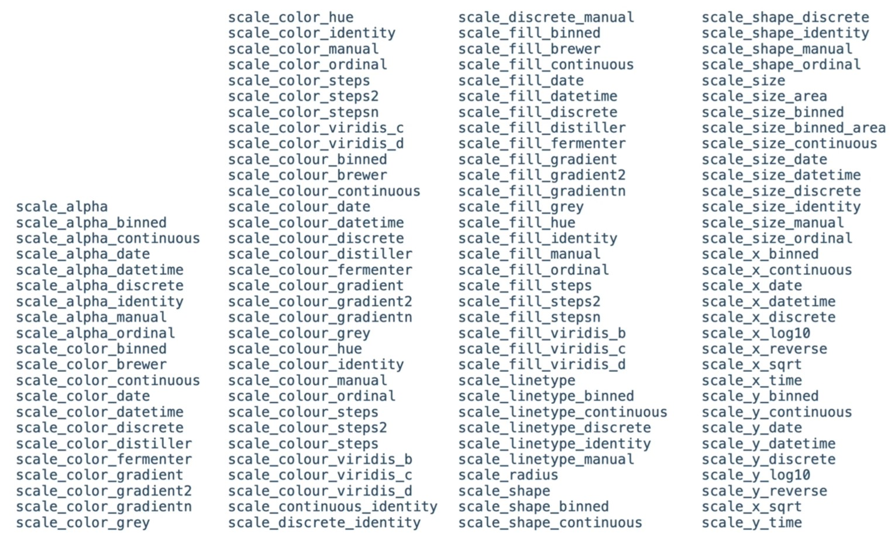
```
:::
:::::

## Scale

::::: columns
::: {.column width="40%"}
:::

::: {.column width="60%"}
```{r}
#| echo: false

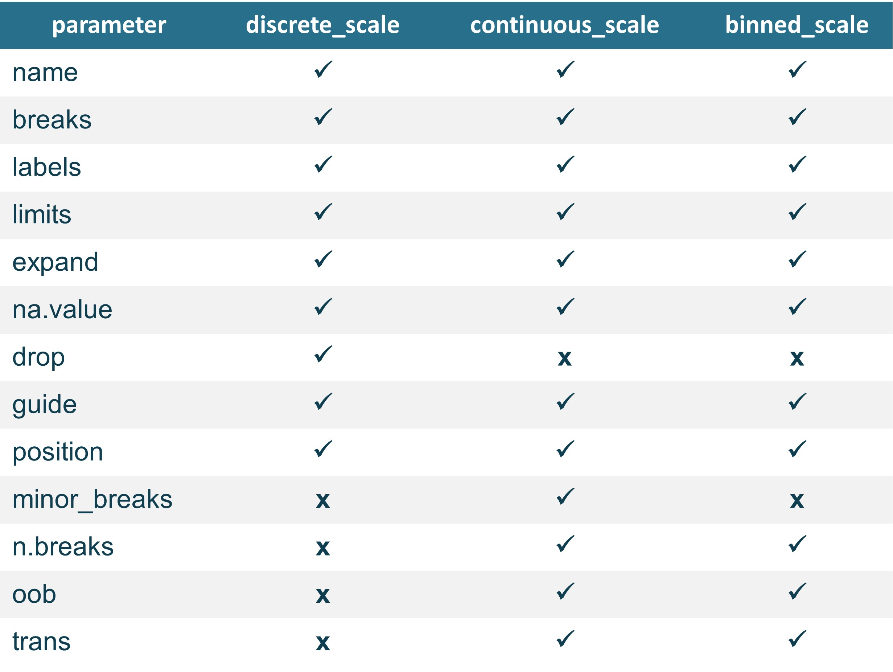
```
:::
:::::

## Scale

::::: columns
::: {.column width="50%"}
```{r}
#| echo: false
iris_data <- iris %>% tibble() %>% janitor::clean_names()
```

```{r}
#| echo: true
#| fig-align: center
#| fig-height: 4
#| fig-width: 7
p <- ggplot(iris_data, aes(x = sepal_length, y = sepal_width, color = species)) + geom_point(size = 2)
p
```
:::

::: {.column width="50%"}
```{r}
#| echo: true
#| fig-align: center
#| fig-height: 4
#| fig-width: 7
p + scale_color_manual(name = "Manual",
                       values = c("#5BC0EB","#FDE74C","#9BC53D"))
```
:::
:::::

## Scale

**Position scales**

::::: columns
::: {.column width="50%"}
#### Continuous

-   scale_x_continuous \| scale_y_continuous
-   scale_x_log10 \| scale_y_log10
-   scale_x_reverse \| scale_y_reverse
-   scale_x_sqrt \| scale_x_sqrt
:::

::: {.column width="50%"}
``` r
scale_x_continuous(
  name = waiver(),
  breaks = waiver(),
  minor_breaks = waiver(),
  n.breaks = NULL,
  labels = waiver(),
  limits = NULL,
  expand = waiver()
  oob = censor,
  na.value = NA_real_,
  trans = "identity",
  position = "bottom",
  guide = waiver,
  )
```
:::
:::::

## Scale

**Position scales**

::::: columns
::: {.column width="50%"}
#### Binned

-   scale_x_binned \| scale_y_binned
:::

::: {.column width="50%"}
``` r
scale_x_binned(
  name = waiver(),
  breaks = waiver(),
  labels = waiver(),
  limits = NULL,
  exapand = waiver()
  oob = censor,
  na.value = NA_real_,
  trans = "identity",
  position = "bottom",
  )
```
:::
:::::

## Scale

**Position scales**

::::: columns
::: {.column width="50%"}
#### Discrete

-   scale_x_discrete \| scale_y_discrete
:::

::: {.column width="50%"}
``` r
scale_x_discrete(
  name = waiver(),
  breaks = waiver(),
  labels = waiver(),
  limits = NULL,
  exapand = waiver()
  oob = censor,
  na.value = NA_real_,
  trans = "identity",
  position = "bottom",
  )
```
:::
:::::

## Scale

**Color scales**

::::: {.columns style="font-size: 80%;"}
::: {.column width="50%"}
Continuous

-   scale_color_continuous \| scale_fill_continuous
-   scale_color_gradient \| scale_fill_gradient

Binned

-   scale_color_binned \| scale_fill_binned
-   scale_color_steps \| scale_fill_steps

Discrete

-   scale_color_discrete \| scale_fill_discrete
-   scale_color_hue \| scale_fill_hue
-   scale_color_grey \| scale_color_grey
:::

::: {.column width="50%"}
```{r}
#| echo: true
#| fig-align: center
#| fig-height: 5
#| fig-width: 6

ggplot(mtcars, aes(mpg, wt, color = cyl)) +
  geom_point(size = 5) +
  scale_color_viridis_c()
```
:::
:::::

## Scale

**Viridis family**

::::: {.columns style="font-size: 80%;"}
::: {.column width="50%"}
Continuous

-   scale_color_viridis_c
-   scale_fill_viridis_c

Binned

-   scale_color_viridis_b
-   scale_fill_viridis_b

Discrete

-   scale_color_viridis_d
-   scale_fill_viridis_d
:::

::: {.column width="50%"}
```{r}
#| echo: true
#| fig-align: center
#| fig-height: 5
#| fig-width: 6

ggplot(mtcars, aes(mpg, wt, color = cyl)) +
  geom_point(size = 5) +
  scale_color_viridis_c()
```
:::
:::::

## Scale

**`scale_*_manual`**

::::: columns
::: {.column width="50%" style="font-size: 80%;"}
-   available only for discrete scales
-   useful if you want to specify your own set of mappings from levels in the data to aesthetic values.

For example

-   choosing set of colors in discrete color scale
-   specifying your own set of alpha
-   specifying your own set of shapes
-   specifying your own set of linetypes
-   ...
:::

::: {.column width="50%"}
``` {.r code-line-numbers="3"}
ggplot(mtcars, aes(x = mpg, y = wt, color = factor(cyl))) +
  geom_point(size = 4) +
  scale_color_manual(values = c("blue", "black", "orange"))
```

```{r}
#| fig-height: 5
#| fig-width: 7
#| fig-align: center

ggplot(mtcars, aes(x = mpg, y = wt, color = factor(cyl))) +
  geom_point(size = 6) +
  scale_color_manual(values = c("blue", "black", "orange")) +
  theme(axis.title = element_text(size = 16),
        axis.text = element_text(size = 14),
        legend.title = element_text(size = 14),
        legend.text = element_text(size = 12)
        )
```
:::
:::::

## Scale

**`scale_*_manual`**

::::: columns
::: {.column width="50%" style="font-size: 80%;"}
-   available only for discrete scales
-   useful if you want to specify your own set of mappings from levels in the data to aesthetic values.

For example

-   choosing set of colors in discrete color scale
-   specifying your own set of alpha
-   specifying your own set of shapes
-   specifying your own set of linetypes
-   ...
:::

::: {.column width="50%"}
``` {.r code-line-numbers="3"}
ggplot(mtcars, aes(x = mpg, y = wt, alpha = factor(cyl))) +
  geom_point(size = 4) +
  scale_alpha_manual(values = c(0.3, 0.6, 1))
```

```{r}
#| fig-height: 5
#| fig-width: 7
#| fig-align: center

ggplot(mtcars, aes(x = mpg, y = wt, alpha = factor(cyl))) +
  geom_point(size = 6) +
  scale_alpha_manual(values = c(0.3, 0.6, 1)) +
  theme(axis.title = element_text(size = 16),
        axis.text = element_text(size = 14),
        legend.title = element_text(size = 14),
        legend.text = element_text(size = 12)
        )
```
:::
:::::

## Scale

**`scale_*_manual`**

::::: columns
::: {.column width="50%" style="font-size: 80%;"}
-   available only for discrete scales
-   useful if you want to specify your own set of mappings from levels in the data to aesthetic values.

For example

-   choosing set of colors in discrete color scale
-   specifying your own set of alpha
-   specifying your own set of shapes
-   specifying your own set of linetypes
-   ...
:::

::: {.column width="50%"}
``` {.r code-line-numbers="3"}
ggplot(mtcars, aes(x = mpg, y = wt, shape = factor(cyl))) +
  geom_point(size = 4) +
  scale_shape_manual(values = c(5, 10, 8))
```

```{r}
#| fig-height: 5
#| fig-width: 7
#| fig-align: center

ggplot(mtcars, aes(x = mpg, y = wt, shape = factor(cyl))) +
  geom_point(size = 6) +
  scale_shape_manual(values = c(5, 10, 8)) +
  theme(axis.title = element_text(size = 16),
        axis.text = element_text(size = 14),
        legend.title = element_text(size = 14),
        legend.text = element_text(size = 12)
        )
```
:::
:::::

## Scales

**Shortcuts**

::::: columns
::: {.column width="50%"}
#### Labs

-   modify axis, legend, and plot labels
-   `xlabs`, `ylabs`: modify `x` and `y` axis label names
-   use `labs` with arguments:
    -   title
    -   x
    -   subtitle
    -   caption
:::

::: {.column width="50%"}
``` {.r code-line-numbers="2-6"}
p + 
  labs(title = "Title of my plot",
       x = "Miles per gallon",
       y = "Weight", #<<
       subtitle = "This would be a subtitle",
       caption = "This is my caption")
```

```{r}
#| fig-height: 5
#| fig-width: 7
#| fig-align: center

ggplot(mtcars, aes(mpg, wt)) + geom_point(size = 3) + 
  labs(title = "Title of my plot", #<<
       x = "Miles per gallon", #<<
       y = "Weight", #<<
       subtitle = "This would be a subtitle", #<<
       caption = "This is my caption") #<<
```
:::
:::::

## Position adjustments

-   All layers have a position that resolves overlapping `geoms`

-   Overrides default using `position` argument to `geom_` or `stat_` function.

## Position adjustments

::::: columns
::: {.column width="50%"}
**`position_jitter`**

-   `?position_jitter`

-   Adds random noise to the data points to avoid overlaps

-   Useful for scatterplots

    -   wrapper: `geom_jitter`

**Parameters**

``` r
seeds = random seeds to make jitter reproducible
width = amount of jitter horizontally
height = amount of jitter vertically
```
:::

::: {.column width="50%"}
``` {.r code-line-numbers="3,4"}
ggplot(mpg, aes(x = class, y = hwy)) + 
  geom_point(size = 3,
             position = position_jitter(width = 0.2,
                                        seed = 143 ))
```

```{r}
#| fig-height: 4
#| fig-width: 6
#| fig-align: center

ggplot(mpg, aes(x = class, y = hwy)) + 
  geom_point(size = 3,
             position = position_jitter(width = 0.2,
                                        seed = 143 ))
```
:::
:::::

## Position adjustments

::::: columns
::: {.column width="50%"}
**`position_stack()`**

-   `?position_stack`

-   Stacks geoms on top of each other.

**`position_fill()`**

-   `?position_fill`

-   Stacks `geoms` on top of each other and standardizes the height.

**Parameters**

``` r
reverse - default = FALSE, if TRUE will reverse the default stacking order.
```
:::

::: {.column width="50%"}
``` r
ggplot(mtcars, aes(x = factor(cyl), fill = factor(vs))) + 
  geom_bar(alpha = 0.5,
           position = "identity")
```

```{r}
#| fig-height: 4
#| fig-width: 6
#| fig-align: center

ggplot(mtcars, aes(x = factor(cyl), fill = factor(vs))) + 
  geom_bar(alpha = 0.5,
           position = "identity")
```
:::
:::::

## Position adjustments

::::: columns
::: {.column width="50%"}
**`position_stack()`**

-   `?position_stack`

-   Stacks geoms on top of each other.

**`position_fill()`**

-   `?position_fill`

-   Stacks `geoms` on top of each other and standardizes the height.

**Parameters**

``` r
reverse - default = FALSE, if TRUE will reverse the default stacking order.
```
:::

::: {.column width="50%"}
``` {.r code-line-numbers="3"}
ggplot(mtcars, aes(x = factor(cyl), fill = factor(vs))) + 
  geom_bar(alpha = 0.5,
           position = "stack")
```

```{r}
#| fig-height: 4
#| fig-width: 6
#| fig-align: center

ggplot(mtcars, aes(x = factor(cyl), fill = factor(vs))) + 
  geom_bar(alpha = 0.5,
           position = "stack")
```
:::
:::::

## Position adjustments

::::: columns
::: {.column width="50%"}
**`position_stack()`**

-   `?position_stack`

-   Stacks geoms on top of each other.

**`position_fill()`**

-   `?position_fill`

-   Stacks `geoms` on top of each other and standardizes the height.

**Parameters**

``` r
reverse - default = FALSE, if TRUE will reverse the default stacking order.
```
:::

::: {.column width="50%"}
``` r
ggplot(mtcars, aes(x = factor(cyl), fill = factor(vs))) + 
  geom_bar(alpha = 0.5,
           position = "fill")
```

```{r}
#| fig-height: 4
#| fig-width: 6
#| fig-align: center

ggplot(mtcars, aes(x = factor(cyl), fill = factor(vs))) + 
  geom_bar(alpha = 0.5,
           position = "fill")

```
:::
:::::

## Position adjustment

::::: columns
::: {.column width="50%"}
**`position_dodge`**

-   `?position_dodge`

-   preserves the vertical position of a geom while adjusting the horizontal position.
:::

::: {.column width="50%"}
``` {.r code-line-numbers="3"}
ggplot(mtcars, aes(x = factor(cyl), fill = factor(vs))) + 
  geom_bar(alpha = 0.5,
           position = "dodge") #<<
```

```{r}
#| fig-height: 4
#| fig-width: 6
#| fig-align: center

ggplot(mtcars, aes(x = factor(cyl), fill = factor(vs))) + 
  geom_bar(alpha = 0.5,
           position = "dodge")
```
:::
:::::

## Position adjustment

::::: columns
::: {.column width="50%"}
**`position_dodge`**

-   `?position_dodge`

-   preserves the vertical position of a geom while adjusting the horizontal position.

**Parameters**

``` r
width(default = 0.9) refers to dodging width
preserve = "single" / "total" (defaul = "total")
```
:::

::: {.column width="50%"}
``` r
ggplot(mtcars, aes(x = factor(cyl), fill = factor(vs))) + 
  geom_bar(alpha = 0.5,
           position = position_dodge(width = 1)) #<<
```

```{r}
#| fig-height: 4
#| fig-width: 6
#| fig-align: center

ggplot(mtcars, aes(x = factor(cyl), fill = factor(vs))) + 
  geom_bar(alpha = 0.5,
           position = position_dodge(width = 1))

```
:::
:::::

## Position adjustment

::::: columns
::: {.column width="50%"}
**`position_dodge`**

-   `?position_dodge`

-   preserves the vertical position of a geom while adjusting the horizontal position.

**Parameters**

``` r
width(default = 0.9) refers to dodging width
preserve = "single" / "total" (defaul = "total")
```
:::

::: {.column width="50%"}
``` {.r code-line-numbers="4"}
ggplot(mtcars, aes(x = factor(cyl), fill = factor(vs))) + 
  geom_bar(alpha = 0.5,
           position = position_dodge(width = 1,
                                     preserve = "single")) #<<
```

```{r}
#| fig-height: 4
#| fig-width: 6
#| fig-align: center

ggplot(mtcars, aes(x = factor(cyl), fill = factor(vs))) + 
  geom_bar(alpha = 0.5,
           position = position_dodge(width = 1,
                                     preserve = "single"))
```
:::
:::::

## Exercise 4

::::: columns
::: {.column width="50%"}
Use the code below to generate a hypothetical dataset and recreate the barplot on the right.

```{r}
#| echo: true
# Create some data
df <- data.frame(supp=rep(c("VC", "OJ"), each=3),
                dose=rep(c("0.5", "1", "2"),2),
                len=c(6.8, 15, 33, 4.2, 10, 29.5))
```
:::

::: {.column width="50%"}
```{r}
#| echo: false
#| fig-height: 8
#| fig-align: center

ggplot(df, aes(x = dose, y = len, fill = supp)) + 
  geom_bar(stat = "identity",
           position = "dodge",
           width = 0.5) +
  scale_fill_brewer(palette = "Paired")
```
:::
:::::

## Coordinates

::::: columns
::: {.column width="50%"}
syntax

```{r}
#| eval: false

ggplot(data = <dataset>,
       mapping = aes(x = <varX>, y = <varY>, ...)) +
  geom_<function>(..., stat = <stat>, position = <position>) +
  geom_<stat>(...) +
  <scale function> +
  <coordinate function>
```

-   Coordinate are sets that locate points in space

-   `coord_cartesian()`

-   `coord_flip()`

-   `coord_polar()`
:::

::: {.column width="50%"}
```{r echo=FALSE, out.width="70%"}

```
:::
:::::

## Coordinates

::::: columns
::: {.column width="50%" style="font-size: 0.8em;"}
**`coord_cartesian()`**

-   default coordinate system

**Zooming into plots**

-   setting limits using scale

    -   eliminates data outside the specified range

-   setting limits using coordinate system

    -   proper way to zoom

    -   does not eliminate data outside the plot

**Parameters**

``` r
xlim, ylim, expand, clip
```
:::

::: {.column width="50%"}
```{r}
#| fig-height: 5
#| fig-width: 6
#| fig-align: center
p <- ggplot(mtcars, aes(x = mpg, y = hp)) + geom_point(size = 3) + geom_smooth(size = 1.5)

print(p)
```
:::
:::::

## Coordinates

::::: columns
::: {.column width="50%" style="font-size: 0.8em;"}
**`coord_cartesian()`**

-   default coordinate system

**Zooming into plots**

-   setting limits using scale

    -   eliminates data outside the specified range

-   setting limits using coordinate system

    -   proper way to zoom

    -   does not eliminate data outside the plot

**Parameters**

``` r
xlim, ylim, expand, clip
```
:::

::: {.column width="50%"}
``` {.r code-line-numbers="2"}
p + 
  scale_x_continuous(limits = c(15, 20))
```

```{r fig.height=4, fig.width=6, fig.align='center'}
#| fig-height: 5
#| fig-width: 6
#| fig-align: center

p + 
  scale_x_continuous(limits = c(15, 20))
```
:::
:::::

## Coordinates

::::: columns
::: {.column width="50%" style="font-size: 0.8em;"}
**`coord_cartesian()`**

-   default coordinate system

**Zooming into plots**

-   setting limits using scale

    -   eliminates data outside the specified range

-   setting limits using coordinate system

    -   proper way to zoom

    -   does not eliminate data outside the plot

**Parameters**

``` r
xlim, ylim, expand, clip
```
:::

::: {.column width="50%"}
``` {.r code-line-numbers="2"}
p + 
  coord_cartesian(xlim = c(15, 20))
```

```{r}
#| fig-height: 5
#| fig-width: 6
#| fig-align: center

p + 
  coord_cartesian(xlim = c(15, 20))
```
:::
:::::

## Coordinates

::::: columns
::: {.column width="50%" style="font-size: 0.8em;"}
**`coord_cartesian()`**

-   default coordinate system

**Zooming into plots**

-   setting limits using scale

    -   eliminates data outside the specified range

-   setting limits using coordinate system

    -   proper way to zoom

    -   does not eliminate data outside the plot

**Parameters**

``` r
xlim, ylim, expand, clip
```
:::

::: {.column width="50%"}
``` {.r codeline-numbers="2"}
p + 
  coord_cartesian(expand = FALSE)
```

```{r}
#| fig-height: 5
#| fig-width: 6
#| fig-align: center

p + 
  coord_cartesian(expand = FALSE)
```
:::
:::::

------------------------------------------------------------------------

## Coordinates

::::: columns
::: {.column width="50%" style="font-size: 0.8em;"}
**`coord_cartesian()`**

-   default coordinate system

**Zooming into plots**

-   setting limits using scale

    -   eliminates data outside the specified range

-   setting limits using coordinate system

    -   proper way to zoom

    -   does not eliminate data outside the plot

**Parameters**

``` r
xlim, ylim, expand, clip
```
:::

::: {.column width="50%"}
``` {.r code-line-numbers="2"}
p + 
  coord_cartesian(expand = FALSE,
                  clip = "off")
```

```{r}
#| fig-height: 5
#| fig-width: 6
#| fig-align: center

p + 
  coord_cartesian(expand = FALSE,
                  clip = "off")
```
:::
:::::

## Coordinates

::::: columns
::: {.column width="50%"}
**`coord_flip()`**

-   Flips cartesian coordinates (i.e., horizontal axis becomes vertical axis).

-   Useful to draw plots in horizontal mode without having to change the aesthetic mappings.
:::

::: {.column width="50%"}
``` {.r code-line-numbers="2"}
p + 
  coord_flip()
```

```{r}
p + 
  coord_flip()
```
:::
:::::

## Coordinates

::::: columns
::: {.column width="50%"}
**`coord_polar()`**

-   Apply a polar coordinate system to the plot

**Parameters**

``` r
theta : map angle to x or y
direction: 1 (clockwise) -1 (anticlockwise)
start: offset of starting point in radian
```
:::

::: {.column width="50%"}
``` {.r code-line-numbers="2"}
ggplot(mpg, aes(x = displ)) + 
  geom_bar()
```

```{r}
#| fig-height: 5
#| fig-width: 6
#| fig-align: center

ggplot(mpg, aes(x = displ)) + 
  geom_bar()
```
:::
:::::

## Coordinates

::::: columns
::: {.column width="50%"}
**`coord_polar()`**

-   Apply a pola coordinate system to the plot

**Parameters**

``` r
theta : map angle to x or y
direction: 1 (clockwise) -1 (anticlockwise)
start: offset of starting point in radian
```
:::

::: {.column width="50%"}
``` {.r code-line-numbers="2"}
ggplot(mpg, aes(x = displ)) + geom_bar() +
  coord_polar()
```

```{r}
#| fig-height: 5
#| fig-width: 6
#| fig-align: center

ggplot(mpg, aes(x = displ)) + geom_bar() +
  coord_polar()
```
:::
:::::

## Coordinates

::::: columns
::: {.column width="50%"}
**`coord_polar()`**

-   Apply a pola coordinate system to the plot

**Parameters**

``` r
theta : map angle to x or y
direction: 1 (clockwise) -1 (anticlockwise)
start: offset of starting point in radian
```
:::

::: {.column width="50%"}
``` {.r code-line-numbers="2"}
ggplot(mpg, aes(x = displ)) + geom_bar() +
  coord_polar(theta = "y")
```

```{r}
#| fig-height: 5
#| fig-width: 6
#| fig-align: center

ggplot(mpg, aes(x = displ)) + geom_bar() +
  coord_polar(theta = "y")
```
:::
:::::

## Coordinates

::::: columns
::: {.column width="50%"}
**`coord_polar()`**

-   Apply a pola coordinate system to the plot

**Parameters**

``` r
theta : map angle to x or y
direction: 1 (clockwise) -1 (anticlockwise)
start: offset of starting point in radian
```
:::

::: {.column width="50%"}
``` {.r code-line-numbers="3"}
ggplot(mpg, aes(x = displ)) + geom_bar() +
  coord_polar(theta = "y",
              direction = -1)
```

```{r}
#| fig-height: 5
#| fig-width: 6
#| fig-align: center

ggplot(mpg, aes(x = displ)) + geom_bar() +
  coord_polar(theta = "y",
              direction = -1)
```
:::
:::::

## Coordinates

::::: columns
::: {.column width="50%"}
**`coord_polar()`**

-   Apply a pola coordinate system to the plot

**Parameters**

``` r
theta : map angle to x or y
direction: 1 (clockwise) -1 (anticlockwise)
start: offset of starting point in radian
```
:::

::: {.column width="50%"}
``` {.r code-line-numbers="3"}
ggplot(mpg, aes(x = displ)) + geom_bar() +
  coord_polar(theta = "y",
              start = 0.5)
```

```{r }
#| fig-height: 5
#| fig-width: 6
#| fig-align: center

ggplot(mpg, aes(x = displ)) + geom_bar() +
  coord_polar(theta = "y",
              start = 0.5)
```
:::
:::::

# Facets and Themes

## Facets

::::: columns
::: {.column width="50%"}
syntax

```{r eval=FALSE}
#| eval: false

ggplot(data = <dataset>,
       mapping = aes(x = <varX>, y = <varY>, ...)) +
  geom_<function>(..., stat = <stat>, position = <position>) +
  geom_<stat>(...) +
  <scale function> +
  <coordinate function> +
  facet_<function>
  
```

-   Facets divide plot into subplots based on the values of one or more discrete variables.

-   `facet_wrap()`

-   `facet_grid()`
:::

::: {.column width="50%"}
```{r}
#| echo: false
#| out-width: 70%


```
:::
:::::

## Facets

::::: columns
::: {.column width="50%"}
**`facet_wrap`**

-   "wraps" a 1d ribbon of panels into 2d
-   useful if you have a variable with many levels

**Parameters**

``` r
ncol
nrow
scales
```
:::

::: {.column width="50%"}
```{r}
#| echo: false

theme_set(theme_gray())
```

```{r}
#| echo: true
#| fig-height: 4
#| fig-width: 6
#| fig-align: center

ggplot(mpg, aes(x = displ, hwy)) + 
  geom_blank() + 
  xlab(NULL)
```
:::
:::::

## Facets

::::: columns
::: {.column width="50%"}
**`facet_wrap`**

-   "wraps" a 1d ribbon of panels into 2d
-   useful if you have a variable with many levels

``` r
ncol
nrow
scales
```
:::

::: {.column width="50%"}
```{r}
#| echo: true
#| fig-height: 4
#| fig-width: 6
#| fig-align: center

ggplot(mpg, aes(x = displ, hwy)) + 
  geom_blank() + 
  xlab(NULL) +
  facet_wrap(~ class) #<<
  
```
:::
:::::

## Facets

::::: columns
::: {.column width="50%"}
**`facet_grid`**

-   produces a 2d grid of panels defined by variables which form the rows and columns

-   `.~ a` spreads the values across columns

-   `b ~ .` spreads the values of `b` down the ro ws

-   `a ~ b` spreads `a` across columns and `b` down rows
:::

::: {.column width="50%"}
```{r}
#| echo: true
#| fig-height: 4
#| fig-width: 6
#| fig-align: center

ggplot(mpg, aes(x = displ, hwy)) + 
  geom_blank() + 
  xlab(NULL) +
  facet_grid(. ~ cyl) #<<
  
```
:::
:::::

## Facets

::::: columns
::: {.column width="50%"}
**`facet_grid`**

-   produces a 2d grid of panels defined by variables which form the rows and columns

-   `.~ a` spreads the values across columns

-   `b ~ .` spreads the values of `b` down the rows

-   `a ~ b` spreads `a` across columns and `b` down rows
:::

::: {.column width="50%"}
```{r}
#| echo: true
#| fig-height: 4
#| fig-width: 6
#| figalign: center

ggplot(mpg, aes(x = displ, hwy)) + 
  geom_blank() + 
  xlab(NULL) +
  facet_grid(drv ~ .) #<<
  
```
:::
:::::

## Facets

::::: columns
::: {.column width="50%"}
**`facet_grid`**

-   produces a 2d grid of panels defined by variables which form the rows and columns

-   `.~ a` spreads the values across columns

-   `b ~ .` spreads the values of `b` down the rows

-   `a ~ b` spreads `a` across columns and `b` down rows
:::

::: {.column width="50%"}
```{r}
#| echo: true
#| fig-height: 4
#| fig-width: 6
#| fig-align: center

ggplot(mpg, aes(x = displ, hwy)) + 
  geom_blank() + 
  xlab(NULL) +
  facet_grid(drv ~ cyl) #<<
  
```
:::
:::::

## Themes

::::: columns
::: {.column width="50%"}
```{r}
#| eval: false

ggplot(data = <dataset>,
       mapping = aes(x = <varX>, y = <varY>, ...)) +
  geom_<function>(..., stat = <stat>, position = <position>) +
  geom_<stat>(...) +
  <scale function> +
  <coordinate function> +
  facet_<function>
  theme_<function>
  
```

-   Controlling all non-data elements
-   title appearance
-   axis labels
-   axis ticks
-   strips
-   ....
:::

::: {.column width="50%"}
```{r echo=FALSE, out.width="70%"}
#| echo: false
#| out-width: 70%


```
:::
:::::

## Themes

::::: columns
::: {.column width="50%"}
**Options**

-   Using the built-in-theme from `ggplot2` library
    -   `theme_gray()`
    -   `theme_bw()`
    -   `theme_light()`
    -   `theme_classic(`)
    -   `...`
-   Using other package e.g., `ggthemes`
:::

::: {.column width="50%"}
```{r}
#| fig-height: 4
#| fig-width: 6
#| fig-align: center

ggplot(mpg, aes(x = displ, hwy, color = factor(cyl))) + 
  geom_point(size = 3) +
  theme_gray() #<<
  
```
:::
:::::

## Themes

::::: columns
::: {.column width="50%"}
**Options**

-   Using the built-in-theme from `ggplot2` library
    -   `theme_gray()`
    -   `theme_bw()`
    -   `theme_light()`
    -   `theme_classic(`)
    -   `...`
-   Using other package e.g., `ggthemes`
:::

::: {.column width="50%"}
```{r}
#| fig-height: 4
#| fig-width: 6
#| fig-align: center

ggplot(mpg, aes(x = displ, hwy, color = factor(cyl))) + 
  geom_point(size = 3) +
  theme_bw() #<<
  
```
:::
:::::

## Themes

::::: columns
::: {.column width="50%"}
**Options**

-   Using the built-in-theme from `ggplot2` library
    -   `theme_gray()`
    -   `theme_bw()`
    -   `theme_light()`
    -   `theme_classic(`)
    -   `...`
-   Using other package e.g., `ggthemes`
:::

::: {.column width="50%"}
```{r}
#| fig-height: 4
#| fig-width: 6
#| fig-align: center

ggplot(mpg, aes(x = displ, hwy, color = factor(cyl))) + 
  geom_point(size = 3, show.legend = FALSE) +
  facet_wrap(~ cyl) +
  theme_bw() #<<
  
```
:::
:::::

## Themes

::::: columns
::: {.column width="50%"}
**Options**

-   Using the built-in-theme from `ggplot2` library
    -   `theme_gray()`
    -   `theme_bw()`
    -   `theme_light()`
    -   `theme_classic(`)
    -   `...`
-   Using other package e.g., `ggthemes`
:::

::: {.column width="50%"}
```{r}
#| fig-height: 4
#| fig-width: 6
#| fig-align: center

ggplot(mpg, aes(x = displ, hwy, color = factor(cyl))) + 
  geom_point(size = 3) +
  theme_classic() #<<
  
```
:::
:::::

## Themes

::::: columns
::: {.column width="50%"}
**Options**

-   Using the built-in-theme from `ggplot2` library

-   Using other package e.g., `ggthemes`

    -   `theme_economist_white()`
    -   `theme_fivethirtyeight()`
    -   `theme_stata()`
    -   `theme_tufte()`
:::

::: {.column width="50%"}
```{r}
#| fig-height: 4
#| fig-width: 6
#| fig-align: center

library(ggthemes)
ggplot(mpg, aes(x = displ, hwy, color = factor(cyl))) + 
  geom_point(size = 3) +
  theme_economist_white() #<<
  
```
:::
:::::

## Themes

::::: columns
::: {.column width="50%"}
**Options**

-   Using the built-in-theme from `ggplot2` library

-   Using other package e.g., `ggthemes`

    -   `theme_economist_white()`
    -   `theme_fivethirtyeight()`
    -   `theme_stata()`
    -   `theme_tufte()`
:::

::: {.column width="50%"}
```{r}
#| fig-height: 4
#| fig-width: 6
#| fig-align: center

ggplot(mpg, aes(x = displ, hwy, color = factor(cyl))) + 
  geom_point(size = 3) +
  theme_fivethirtyeight() #<<
  
```
:::
:::::

## Themes

::::: columns
::: {.column width="50%"}
**Options**

-   Using the built-in-theme from `ggplot2` library

-   Using other package e.g., `ggthemes`

    -   `theme_economist_white()`
    -   `theme_fivethirtyeight()`
    -   `theme_stata()`
    -   `theme_tufte()`
:::

::: {.column width="50%"}
```{r}
#| fig-height: 4
#| fig-width: 6
#| figalign: center

library(ggthemes)
ggplot(mpg, aes(x = displ, hwy, color = factor(cyl))) + 
  geom_point(size = 3) +
  theme_stata() #<<
  
```
:::
:::::

## Themes

::::: columns
::: {.column width="50%"}
**Options**

-   Using the built-in-theme from `ggplot2` library

-   Using other package e.g., `ggthemes`

    -   `theme_economist_white()`
    -   `theme_fivethirtyeight()`
    -   `theme_stata()`
    -   `theme_tufte()`
:::

::: {.column width="50%"}
```{r}
#| fig-height: 4
#| fig-width: 6
#| fig-align: center

library(ggthemes)
ggplot(mpg, aes(x = displ, hwy, color = factor(cyl))) + 
  geom_point(size = 3) +
  theme_tufte() #<<
  
```
:::
:::::

## Practice exercise

::::: columns
::: {.column width="50%"}
**Let's apply what we have covered!**

-   Use the mpg dataset to recreate the plot.

-   But first, we need to do some data wrangling!

-   Use the updated mpg data to mimic the plot.
:::

::: {.column width="50%"}
```{r}
#| echo: false

mpg_2 <- mpg %>% 
  mutate(drive = case_when(drv == "f" ~ "front-wheel drive",
                           drv == "r" ~ "rear-wheel drive",
                           drv == "4" ~ "4-wheel drive"),
         transport = case_when(str_detect(trans, "auto") ~ "automatic trans.",
                               str_detect(trans, "manual") ~ "manual trans."))
```

```{r}
#| echo: false
#| fig-height: 4
#| fig-width: 6
#| fig-align: center

ggplot(mpg_2, aes(displ, hwy)) + 
  geom_point(size = 3, alpha = 0.5) +
  geom_smooth(method = "lm") +
  facet_grid(transport ~ drive) +
  theme_bw() +
  theme(plot.title = element_text(hjust = 0.5, face = "bold"),
        strip.text = element_text(face = "bold")) +
  labs(title = "Car fuel consumption",
       x  = "Engine displacement (volume in litres)",
       y = "Highway miles per gallon (mpg)")
```
:::
:::::

# 

{fig-align="center" height="40%" width="40%"}